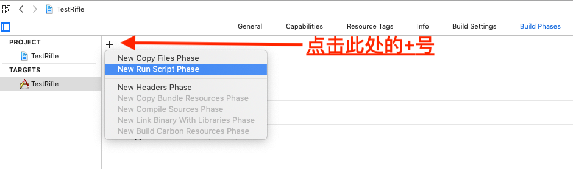
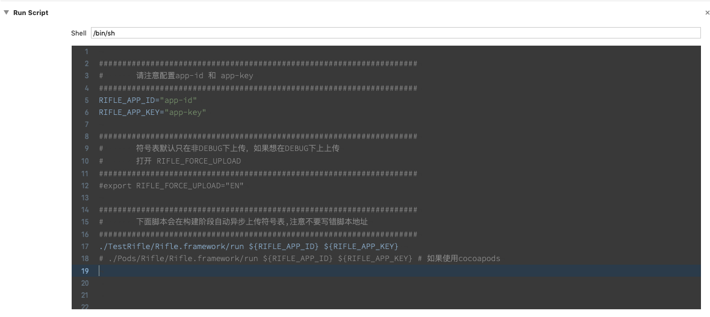

## SDK接入指南

`Rifle`提供两种接入方式供iOS开发者选择

- 通过cocoapods **(推荐)**
- 手动接入


#### 通过cocoapods接入

在工程的`Podfile`里面添加以下代码：

<pre>
pod <font color=bf242a>'Rifle'</font>
</pre>

保存并执行`pod install`,然后用后缀为`.xcworkspace`的文件打开工程。

> 注意:

> <font color=#bf242a>命令行下执行`pod search Rifle`,如显示的`Rifle`版本不是最新的，则先执行pod repo update操作更新本地repo的内容 </font>

> 关于`CocoaPods`的更多信息请查看 [CocoaPods官方网站](https://cocoapods.org)

#### 手动接入

- 下载[Rifle iOS SDK](./geng-xin-ri-zhi.md) 
- 拖拽`Rifle.framework`文件到Xcode工程内(注意勾选Copy items if needed选项)
- 添加依赖库：
	- SystemConfiguration.framework
	- Security.framework
	- libz.tbd
	- libc++.tbd

## 符号表

符号表上传有两种方式：
- 自动上传 (默认方式)
- 手动上传

推荐使用自动上传，如果自动上传失败或者需要从AppStore下载符号表上传，则使用手动上传。

#### 自动上传

自动上传脚本位于`Rifle.framework`文件夹内，在将`Rifle.framework`通过cocopods或者手动方式添加到工程中之后，在Xcode工程里的
`Targets - Build Phases`处添加脚本







- 脚本可以复制下面的内容


<pre style="background: #393939;">
<font color=919191>####################################################################
#       请注意配置app-id 和 app-key
####################################################################</font>
RIFLE_APP_ID=<font color=#a76b35>"app-id"</font>
RIFLE_APP_KEY=<font color=#a76b35>"app-key"</font>
<font color=919191>
####################################################################
#       符号表默认只在非DEBUG下上传，如果想在DEBUG下上上传
#       打开 RIFLE_FORCE_UPLOAD
####################################################################
#export RIFLE_FORCE_UPLOAD="EN"</font>
<font color=919191>
####################################################################
#       下面脚本会在构建阶段自动异步上传符号表,注意不要写错脚本地址
####################################################################</font>
./TestRifle/Rifle/Rifle.framework/run ${<font color=#a76b35>RIFLE_APP_ID</font>} ${<font color=#a76b35>RIFLE_APP_KEY</font>}
<font color=#919191># ./Pods/Rifle/iOS/Rifle.framework/run ${RIFLE_APP_ID} ${RIFLE_APP_KEY} # 如果使用cocoapods </font>
</pre>

#### 手动上传

- 将 `upload_dsym`、 `dump_dsymbols`和要解析的`.dsym`文件放在同一个目录下，执行以下脚本

```
./upload_dsym ./xxxxxx.dsym app-version app-id app-key
```

则会看到执行的log信息，并且在当前目录下会生成<font color=#bf242a>symbols.zip</font>的文件

- 如果只是生成符号表文件，暂时不上传，可以执行


```
./upload_dsym ./xxxxxx.dsym
```


- 如果要查看帮助信息，执行


 ```
 ./upload_dsym --help
 ```


会看到如下信息：

>  ⚠️  注意：
	1. 如果需要上传符号表到Rifle服务器，需要传递四个参数 
>
		第一个参数是  .dsym文件的路径，ex: ./TestRifle.app.dSYM, 其中 TestRifle 须和APP名称保持一致
		第二个参数是 app-version 
		第三个参数是app-id 
		第四个参数是app-key 
>
	🔹 如果只是解析符号表，只需要传递第一个参数即可 
>
	2. 必须把可执行文件 dump_symbols 和upload_dsym放在同一目录下，否则解析符号表会失败！
>
	3. 上传过程中会把最终的符号表拷贝到当前目录下，文件名为 symbols.zip,如果上传失败，可以通过网址：www. 手动上传. 


## SDK使用

#### 初始化

**导入头文件**

在工程的`AppDelegate.m`文件导入头文件


```
#import <Rifle/Rifle.h>
```

> 如果是`Swift`工程，请在对应`bridging-header.h`中导入

**初始化**

- Objective-C

<pre>
- (BOOL)application:(UIApplication *)application didFinishLaunchingWithOptions:(NSDictionary *)launchOptions {
    [Rifle startWithAppId:<font color=#bf242a>@"此处替换为你的AppId"</font> config:nil];
    return YES;
}
</pre>

- Swift

<pre>
func application(application: UIApplication, didFinishLaunchingWithOptions launchOptions: [NSObject: AnyObject]?) -> Bool {
    Rifle.startWithAppId(<font color=#bf242a>"此处替换为你的AppId"</font>)
    return true
}
</pre>


**业务标签**
⚠️如果使用了业务标签功能,SDK需要知道每个页面名,请在项目的`viewController`基类的`viewWillAppear:`方法中调用`+updateCurrentPage:`方法**(推荐)**,或者使用`MathodSwizzing` hook `viewWillAppear:`方法添加.

- Objective-C

```
//BaseViewController.m
- (void)viewWillAppear:(BOOL)animated {
    [super viewDidAppear:animated];
    [Rifle updateCurrentPage:@"RootViewController"];
}
```

- Swift

```
//BaseViewController.swift
override func viewWillAppear(_ animated: Bool) {
    super.viewWillAppear(animated)
    Rifle.updateCurrentPage("RootViewController")//页面标识可以自定义,例如在webView页面可以传递URL等信息作为页面标识.
}
```


